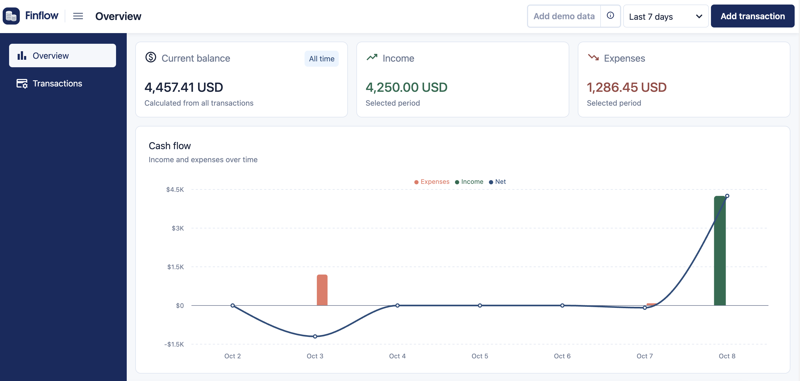
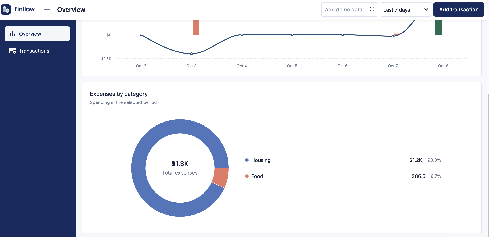
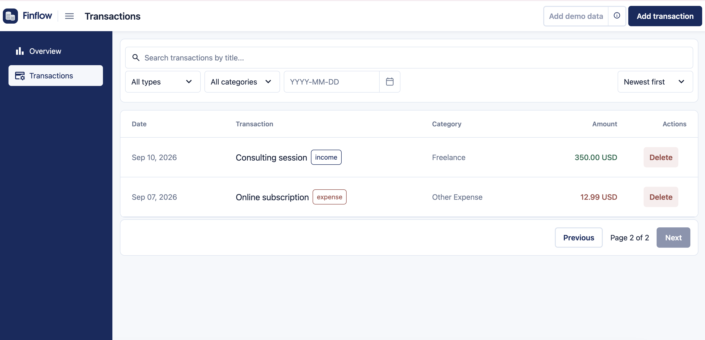
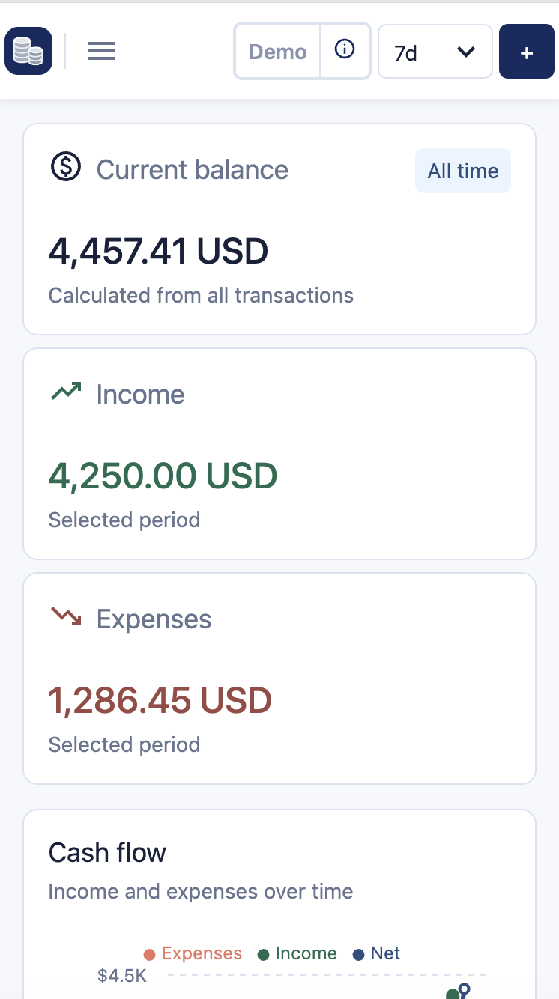
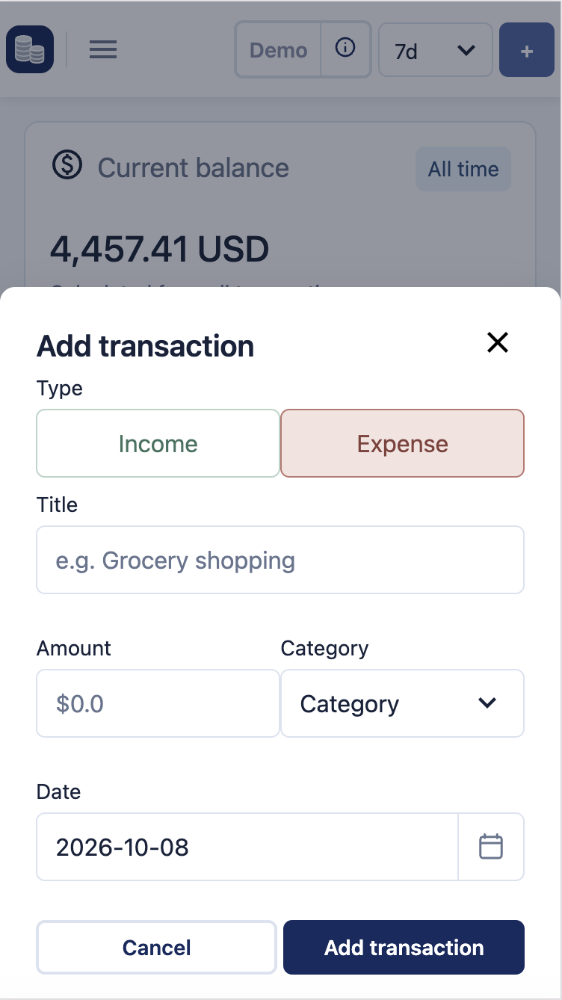
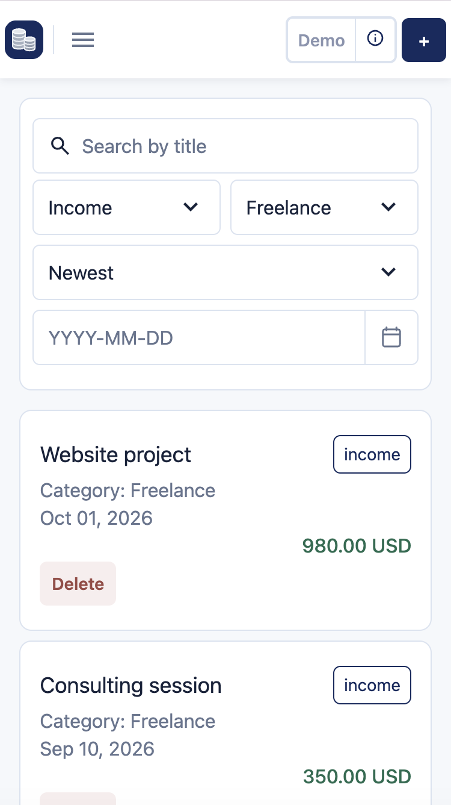

# FinFlow

[](https://github.com/YanaKharlamova/finflow/actions/workflows/ci.yml)

FinFlow is a responsive finance dashboard for tracking transactions and analyzing income, expenses, cash flow, and spending by category.

**[View Live Demo →](https://finflow-three-beta.vercel.app)**

## Features

- Financial overview with balance, income, expenses, cash flow, and category analytics
- Transaction creation and deletion
- Search, filtering, sorting, and pagination
- Responsive layout for desktop and mobile
- Loading, fetching, empty, and error states
- Mock API powered by MSW

## Screenshots

### Overview





### Transactions



### Mobile

| Overview | Add transaction | Transactions |
| --- | --- | --- |
|  |  |  |

## Tech Stack

- React
- TypeScript
- Vite
- Redux Toolkit
- RTK Query
- React Router
- Recharts
- Radix UI
- styled-components
- MSW
- Vitest
- React Testing Library
- Playwright

## Technical Highlights

- RTK Query for server-state management, caching, and cache invalidation
- URL-synchronized analytics periods and transaction pagination
- Mock REST API implemented with MSW
- Route-level lazy loading
- Responsive desktop and mobile layouts
- Separate loading, fetching, empty, and error states
- Integration testing with Vitest, React Testing Library, and MSW
- Browser smoke testing with Playwright

## Testing

Tests cover key user flows and application behavior, including:

- Transaction creation, deletion, and retry flows
- Browser-level transaction creation with Playwright
- Required-field and date validation
- Date filtering, search, and pagination
- Overview rendering and period changes
- Empty and error states

## Getting Started

Install dependencies:

```bash
npm install
```

Start the development server:

```bash
npm run dev
```

The application uses an in-browser mock API, so no backend setup is required. Mock transaction data is stored in memory and resets after a page reload.

## Scripts

```bash
npm run dev        # Start the development server
npm run build      # Create a production build
npm run preview    # Preview the production build
npm run test:run   # Run tests once
npm run test:e2e   # Run the Playwright browser test
npm run typecheck  # Check TypeScript types
npm run lint       # Run ESLint and Knip
```

## Deployment

The project is [deployed on Vercel](https://finflow-three-beta.vercel.app/) and supports direct navigation and page refresh for React Router routes.
